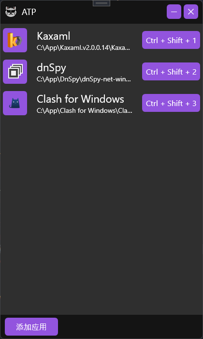

# :zap::zap::zap: ATP

> :full_moon_with_face: Windows 的 `Alt+Tab` 有点啰嗦，通过熟悉的快捷键，可以在IDE等常用软件中来回的穿梭，所以就有了这个小辣鸡 :)

## 能干啥？

通过自定义快捷键，完成两件事儿：
* 快速打开指定应用。
* 在应用之间快速切换。

## 自拍!

## 后续

整天忙着躺平，真的没时间写代码。

- [ ] 改改界面（我自己看着都烦）
- [ ] 窗口的切换好像有点问题
- [ ] 添加应用那好像也不完美
- [ ] 争取甩掉 `小辣鸡` 的外号

